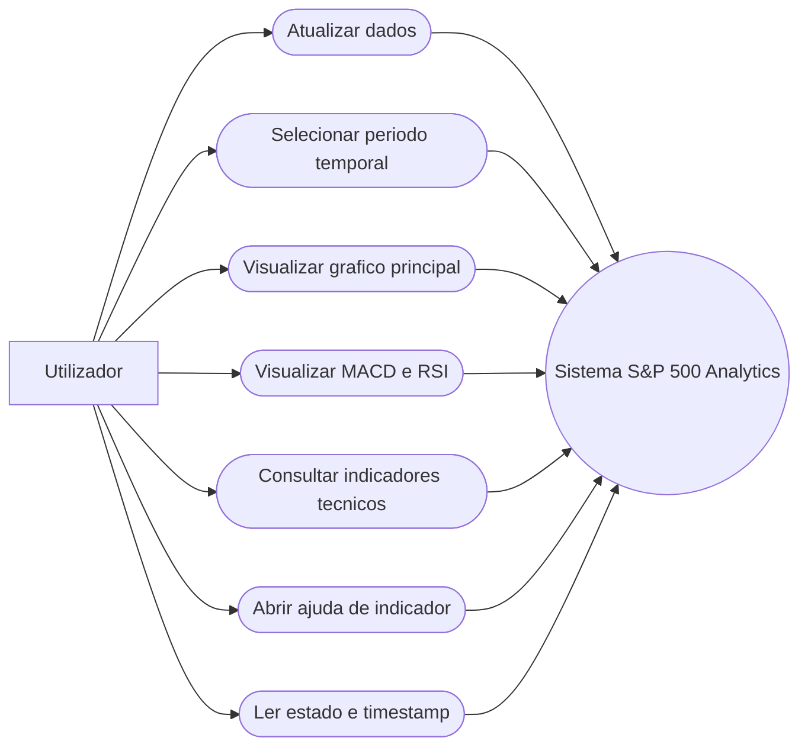
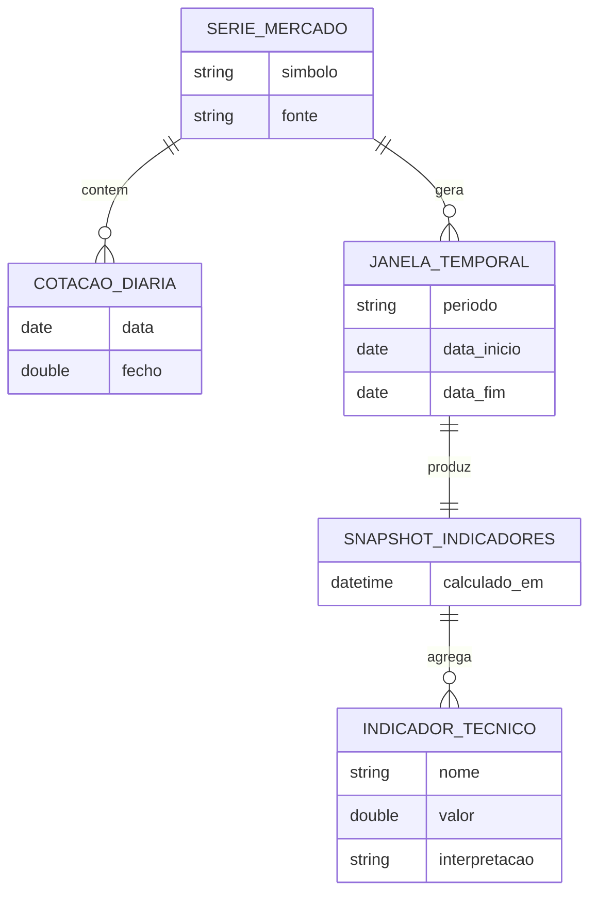
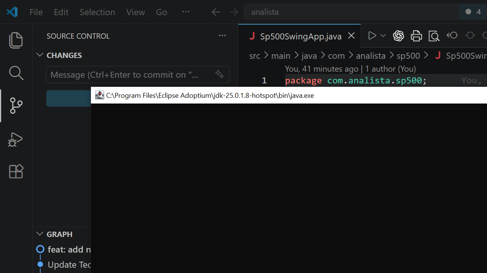
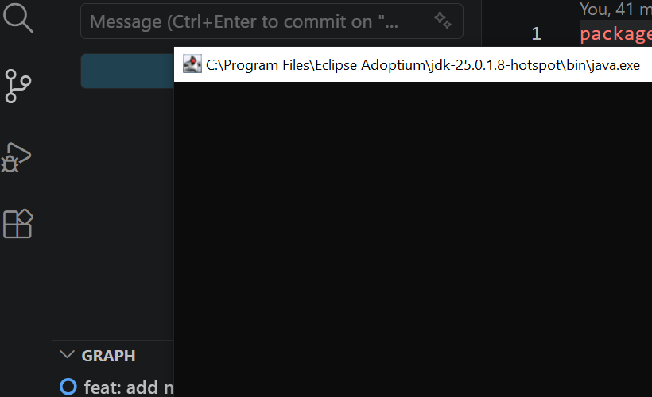
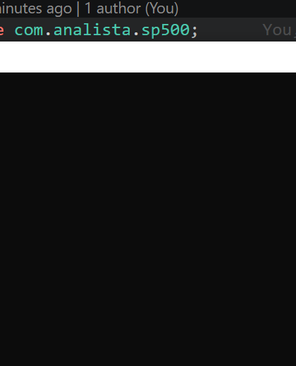

# Relatório de Desenvolvimento de Projeto

## Introdução
Este relatório descreve o desenvolvimento de uma aplicação desktop em Java Swing para análise técnica do índice S&P 500.  
O objetivo principal do projeto foi criar um dashboard visual, interativo e de leitura rápida, capaz de:

- obter cotações históricas diárias do S&P 500 a partir de uma fonte pública;
- apresentar evolução temporal em múltiplos horizontes;
- calcular indicadores técnicos clássicos;
- melhorar continuamente a experiência de utilização (UI/UX), incluindo tema escuro e ajuda contextual.

A versão atual disponibiliza um painel principal de gráficos (Preço/Desempenho + MACD + RSI), painel lateral de indicadores com interpretação visual e sistema de ajuda por indicador.

---

## Análise de Contexto
### Problema identificado
Ferramentas de análise técnica costumam ser excessivamente complexas para utilizadores que apenas precisam de uma visão clara do mercado.  
Havia necessidade de uma solução:

- simples de executar localmente;
- sem dependências pesadas de plataforma;
- com foco em indicadores realmente usados;
- com leitura visual imediata.

### Público-alvo
- Utilizadores que acompanham mercados e desejam leitura técnica rápida.
- Estudantes de análise técnica e desenvolvimento desktop Java.
- Profissionais que preferem ferramentas locais, leves e transparentes.

### Contexto tecnológico
- Linguagem: Java (OpenJDK/Temurin).
- UI: Swing.
- Fonte de dados: endpoint CSV público (Stooq, símbolo `^SPX`).
- Execução: desktop local, sem base de dados persistente.

---

## Requisitos
### Requisitos gerais do produto
- Exibir desempenho do S&P 500 em vários períodos.
- Disponibilizar indicadores técnicos principais.
- Oferecer uma interface clara, responsiva e legível em tema escuro.
- Reduzir fricção de aprendizagem com explicações contextuais.

### Restrições e premissas
- Sem autenticação/API key.
- Dependência de conectividade à internet para atualização dos dados.
- Dados de referência baseados em fecho diário.

---

## Requisitos Funcionais
### RF-01: Carregamento de dados do S&P 500
- A aplicação deve obter dados históricos diários via HTTP.
- Deve tratar respostas inválidas e linhas CSV malformadas sem crash.

### RF-02: Filtro temporal
A aplicação deve permitir alternar entre:

- `1 dia`
- `5 dias`
- `1 mes`
- `1 ano`
- `3 anos`
- `5 anos`
- `Desde o inicio`

### RF-03: Gráfico principal de desempenho
- Exibir a evolução relativa (%) do preço no período selecionado.
- Sobrepor:
  - SMA 50
  - SMA 200
  - Bandas de Bollinger (20,2)

### RF-04: Subgráficos técnicos
- Exibir, abaixo do gráfico principal:
  - MACD (12,26,9) com histograma e linha de sinal;
  - RSI (14) com zonas de referência (30/70).

### RF-05: Painel lateral de indicadores
- Exibir valores numéricos de:
  - último fecho, SMA20/50/200, EMA20;
  - RSI14;
  - MACD, sinal MACD, histograma;
  - bandas de Bollinger (superior/média/inferior);
  - máximo e mínimo de 52 semanas.
- Exibir sinais sintéticos (`Alta`, `Baixa`, `Neutro`, etc.) nos cartões de leitura rápida.

### RF-06: Ajuda contextual por indicador
- Cada indicador deve ter botão `?`.
- Clique deve abrir uma janela dedicada com explicação detalhada.

### RF-07: Atualização manual
- O utilizador deve conseguir forçar atualização de dados via botão.

### RF-08: Feedback de estado
- A UI deve mostrar estado do período, retorno acumulado e timestamp da última atualização.

---

## Requisitos Não-Funcionais
### RNF-01: Usabilidade
- Interface com hierarquia visual clara e baixa carga cognitiva.
- Legendas e elementos de apoio nunca devem ocultar a área crítica do gráfico.

### RNF-02: Desempenho percebido
- Carregamento de dados em background (`SwingWorker`) para manter UI responsiva.

### RNF-03: Robustez
- Tolerância a falhas de rede e parsing.
- Fallback para janelas temporais muito curtas (evitando renderização inviável com 1 ponto).

### RNF-04: Portabilidade
- Execução em ambiente desktop com Java 17+.

### RNF-05: Manutenibilidade
- Separação por responsabilidade:
  - dados;
  - cálculo de indicadores;
  - apresentação;
  - tema/estilo.

### RNF-06: Acessibilidade visual
- Tema escuro com contraste elevado.
- Tipografia consistente.
- Componentes clicáveis com affordance clara.

---

## Diagramas de Casos de Uso
### Diagrama (visão global)

### Casos de uso principais (resumo)
1. **Atualizar dados**: utilizador solicita nova carga da série histórica.
2. **Selecionar período**: sistema refiltra série e recalcula leitura visual.
3. **Visualizar gráfico composto**: sistema apresenta preço + overlays + subgráficos.
4. **Consultar ajuda**: utilizador clica `?` e obtém explicação do indicador.

---

## User Stories
1. **Como utilizador**, quero mudar rapidamente entre períodos curtos e longos para comparar o comportamento do índice em diferentes horizontes.
   - Critério: seleção de período atualiza gráficos e indicadores sem bloquear a UI.

2. **Como utilizador**, quero ver MACD e RSI no mesmo ecrã do preço para avaliar momentum sem alternar de vista.
   - Critério: MACD e RSI aparecem abaixo do gráfico principal, sincronizados temporalmente.

3. **Como utilizador**, quero indicadores resumidos com sinal visual para interpretar rapidamente contexto de mercado.
   - Critério: cartões de sinal mostram estado (`Alta`, `Baixa`, etc.) e painel mostra métricas detalhadas.

4. **Como utilizador não especialista**, quero clicar num `?` e entender o indicador em linguagem clara.
   - Critério: abre janela com descrição de “o que mede”, “como interpretar” e “boas práticas”.

5. **Como utilizador**, quero tema escuro com boa legibilidade para uso prolongado.
   - Critério: contraste adequado em texto, linhas, fundos e elementos de interação.

---

## Análise de Domínio / Modelo Entidade-Relação
Embora o projeto não use base de dados, foi definido um modelo conceptual de domínio:

- **SerieMercado**: coleção temporal de cotações.
- **CotacaoDiaria**: data + preço de fecho.
- **JanelaTemporal**: recorte da série para cálculo/renderização.
- **SnapshotIndicadores**: conjunto de indicadores calculados para uma janela.
- **IndicadorTecnico**: RSI, MACD, SMA, EMA, Bollinger, etc.

### Modelo ER conceptual

---

## Análise da Estrutura do Projeto
### Organização principal
Pacote: `com.analista.sp500`

- `Sp500SwingApp`: ponto de entrada da aplicação.
- `MainFrame`: composição do dashboard e fluxo principal de interação.
- `Sp500DataService`: obtenção HTTP e parsing CSV.
- `Sp500DataPoint`: estrutura de cotação diária.
- `TimeRange`: enumeração de períodos temporais.
- `PerformanceChartPanel`: renderização dos gráficos (preço, MACD, RSI).
- `TechnicalIndicatorsCalculator`: cálculo de indicadores.
- `TechnicalIndicators`: estrutura agregada de resultados.
- `TechnicalIndicatorsPanel`: painel lateral de indicadores e botões de ajuda.
- `IndicatorHelpDialog`: janela dedicada de explicação contextual.
- `UiTheme` + `RoundedLineBorder`: sistema visual (tema escuro e estilo de componentes).

### Arquitetura lógica (camadas)
1. **Dados**
   - `Sp500DataService` -> obtém e normaliza série histórica.
2. **Domínio/Cálculo**
   - `TechnicalIndicatorsCalculator` -> gera métricas técnicas.
3. **Apresentação**
   - `MainFrame`, `PerformanceChartPanel`, `TechnicalIndicatorsPanel`, `IndicatorHelpDialog`.
4. **Design system**
   - `UiTheme`, `RoundedLineBorder`.

### Decisões de design relevantes
- Uso de `SwingWorker` para I/O em background.
- Layout central com `JSplitPane` para priorizar gráfico.
- Legenda sempre fora da área crítica do plot.
- Ajuda por indicador via janela própria com scroll.

---

## Apresentação do Projeto Final (Screenshots da UI)
### 1) Dashboard completo (tema escuro)

### 2) Detalhe da área de gráficos

### 3) Detalhe do painel de indicadores

---

## Conclusão Geral / Reflexão Final
O projeto evoluiu de um gráfico simples para uma aplicação de análise técnica significativamente mais completa, com:

- múltiplos horizontes temporais (de curto a longo prazo);
- visualização integrada de tendência, momentum e volatilidade;
- painel de indicadores com leitura rápida e detalhe;
- ajuda contextual rica para reduzir curva de aprendizagem;
- tema escuro consistente, com foco em legibilidade e ergonomia.

Do ponto de vista de engenharia, o resultado apresenta boa separação de responsabilidades e uma base sólida para evolução futura.

### Pontos fortes alcançados
- UX clara para utilização prática diária.
- Modularidade adequada para manutenção e extensão.
- Robustez aceitável para consumo de dados públicos.

### Próximas evoluções recomendadas
- Exportação de relatório (PDF/PNG) diretamente da aplicação.
- Persistência local de configurações (tema, período padrão, layout).
- Camada de testes automatizados para cálculo dos indicadores.
- Comparação multi-ativos (ex.: S&P 500 vs Nasdaq).

